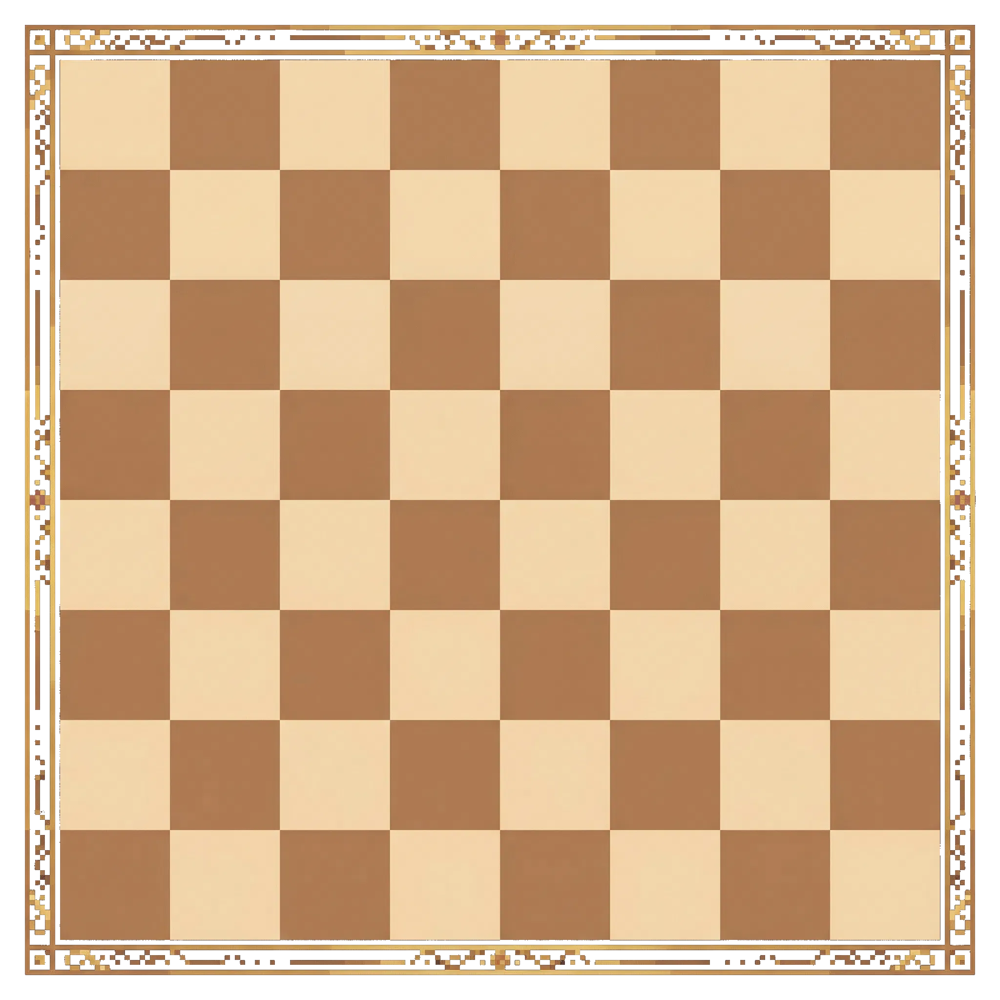

# Welcome to Card Chess

Card Chess blends classic chess movement with a hand of tactical cards.

## Win Conditions
- Checkmate your opponent.
- Run down their clock.

## Turn Flow
- Draw and play cards to fuel your plan.
- Move a chess piece.
- End your turn and watch the timer.
